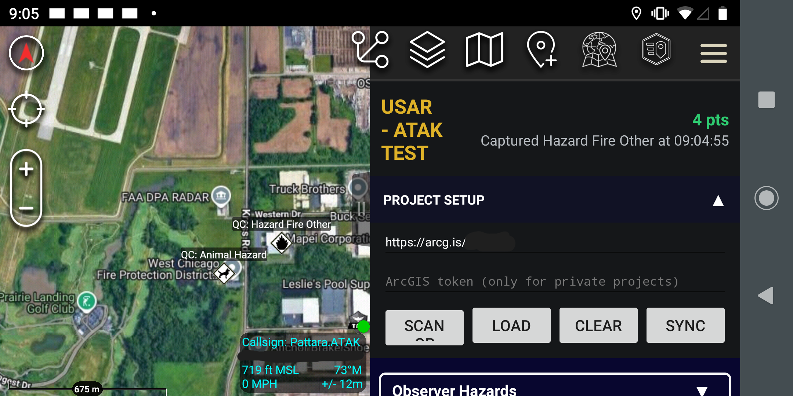
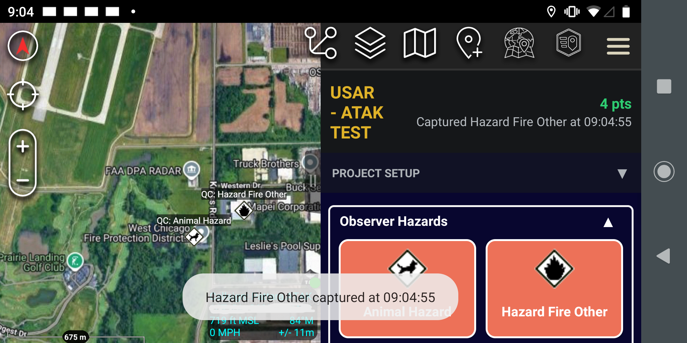
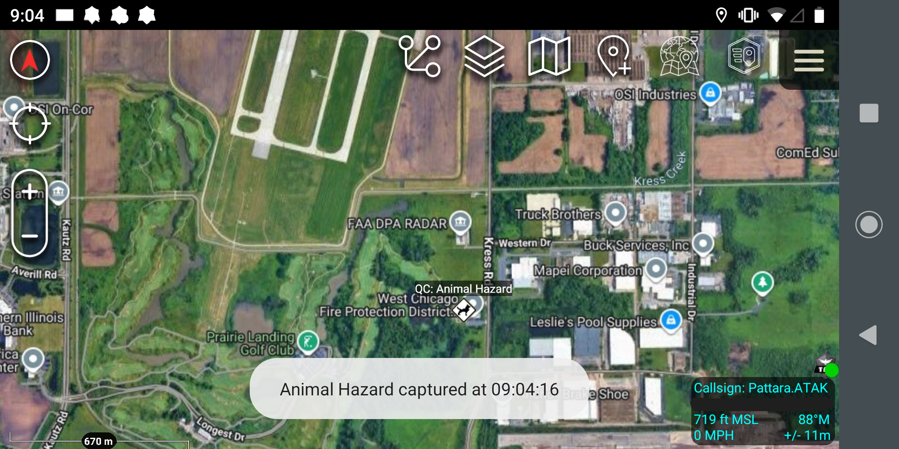
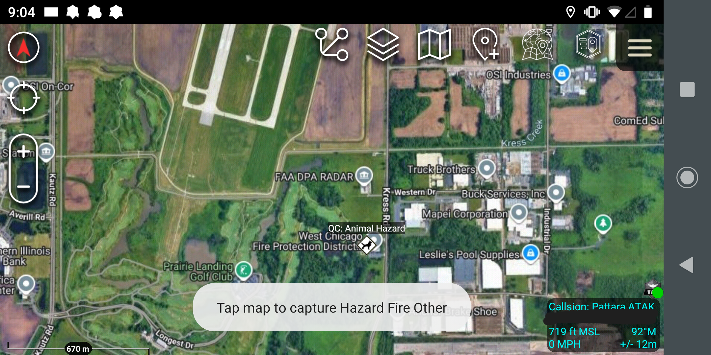
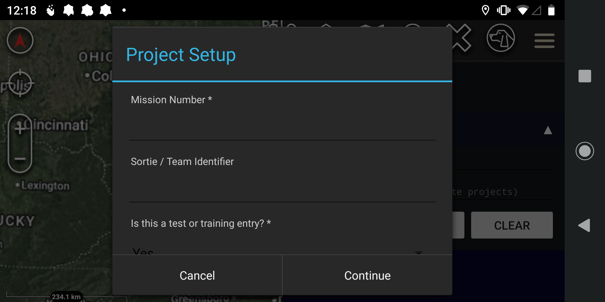

# QuickCapture

[](https://github.com/jpat-12/ATAK-Plugin-QuickCapture/releases/tag/v1.5.0)

ATAK CIV 5.6 plugin that downloads ArcGIS QuickCapture project definitions and
renders their capture-button interface in an ATAK half-screen dropdown.

## Implemented

- Camera QR scanning inside ATAK
- QuickCapture deep links, ArcGIS item links, bare item IDs, and direct
  `FeatureServer` layer URLs
- Public projects and private projects with a supplied ArcGIS token
- Project `dataSources`, `templateGroups`, `templates`, `fieldInfos`, and
  `userInputs`
- Native-style grouped button grid using project labels, colors, and columns
- Required text/numeric inputs and coded-value pickers
- ATAK self-marker geometry and variable substitution for callsign, timestamp,
  project name, latitude, longitude, and altitude
- ArcGIS Feature Service `addFeatures` submission
- Last-project restore

## Screenshots

**Project setup and capture buttons**


**Plugin loaded with toast notification and icon placement**


**Hazard toast notification and icon placement**


**Manual drop via long-hold with toast notification**


**Pop-up information panel**


## Build

Copy `local.properties.example` to `local.properties` and set the paths for
your environment:

```properties
sdk.dir=/path/to/android-sdk
takrepo.url=...
```

The ATAK SDK (`main.jar`) goes in `app/libs/`. See the ATAK developer guide for
SDK setup details.

Build the debug APK:

```powershell
.\gradlew.bat CivDebug
```

## Remaining Native-Parity Work

Esri OAuth sign-in/token refresh, project image resources, photo/video
attachments, continuous line/polygon captures, tracking, offline replicas/edit
queueing, and advanced project rules are not yet implemented.
